# Abide

A client portal for mental health practitioners. Clients complete regular check-ins, track their progress over time, and access resources assigned by their practitioner. The admin side gives the practitioner a clear view of each client's progress and the tools to manage content and questionnaires.

**Live demo:** https://honest-portal.vercel.app/

## Tech stack

- **React 19** + **TypeScript** — built with Vite
- **Redux Toolkit** — app state (questionnaires, responses, resources, theme); RTK Query for external data
- **Supabase** — authentication and database
- **MUI v9** — component library _ custom react components
- **SCSS modules** — component-level styles with a shared design token system
- **Recharts** — progress charts
- **Vitest** + **Testing Library** — unit and accessibility tests
- **Biome** — linting and formatting

---

## Local development

Requires a Supabase project. Add a `.env` file at the root:

```
VITE_SUPABASE_URL=your_project_url
VITE_SUPABASE_ANON_KEY=your_anon_key
```

```bash
npm install
npm run start       # dev server
npm run build       # production build → dist/
npm run test        # Vitest in watch mode
npm run sync-tokens # sync SCSS $variables → CSS custom properties
```

---

## Screenshots

### Sign in

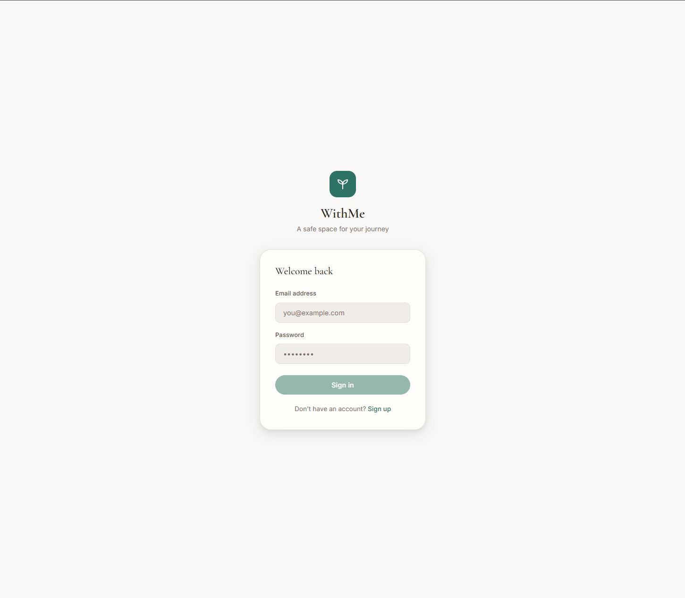

---

### Admin — Dashboard

At a glance: active clients, check-ins, resources, and quick actions to create questionnaires, resources, or sign-up tokens.

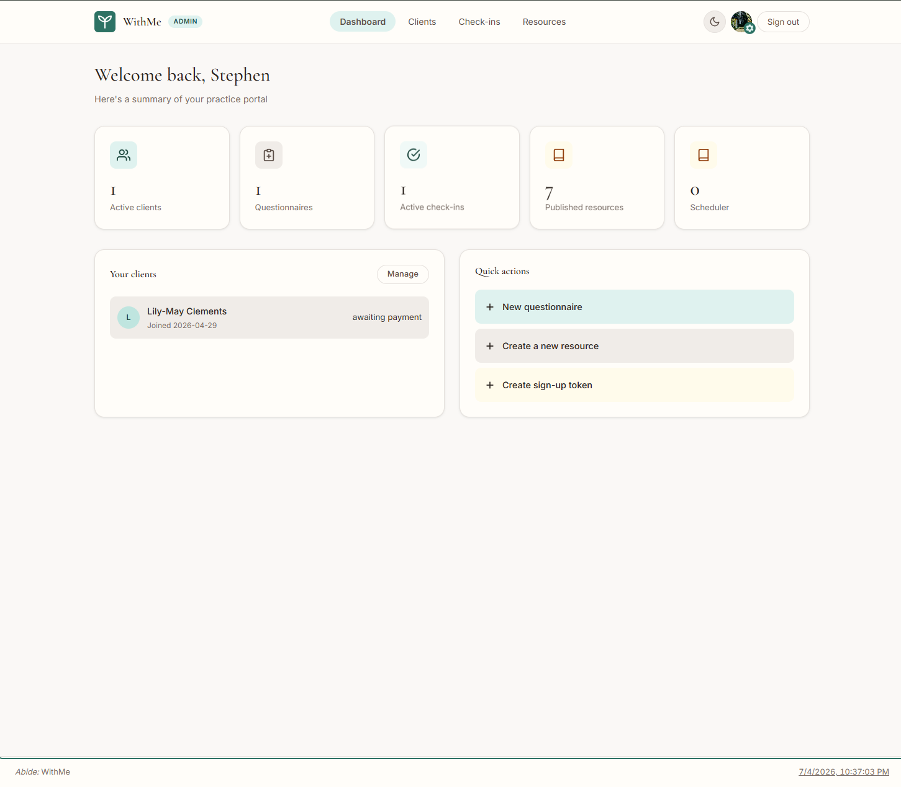

---

### Admin — Client detail & session scheduling

Full client profile with a live wellbeing progress chart. Schedule one-off or recurring sessions with duration, payment status, and prep notes.

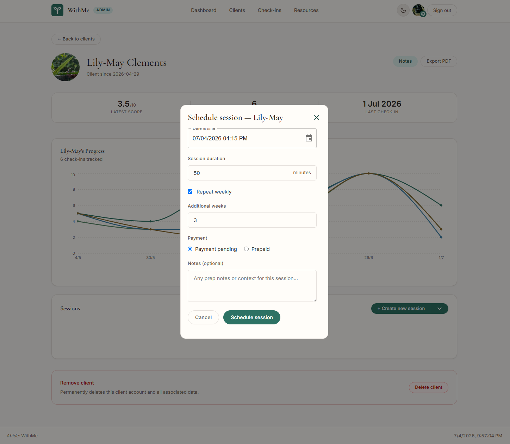

---

### Admin — Check-in management

Create and manage check-ins with configurable questions (free text or 1–10 scale with chart tags). Assign check-ins to specific clients.

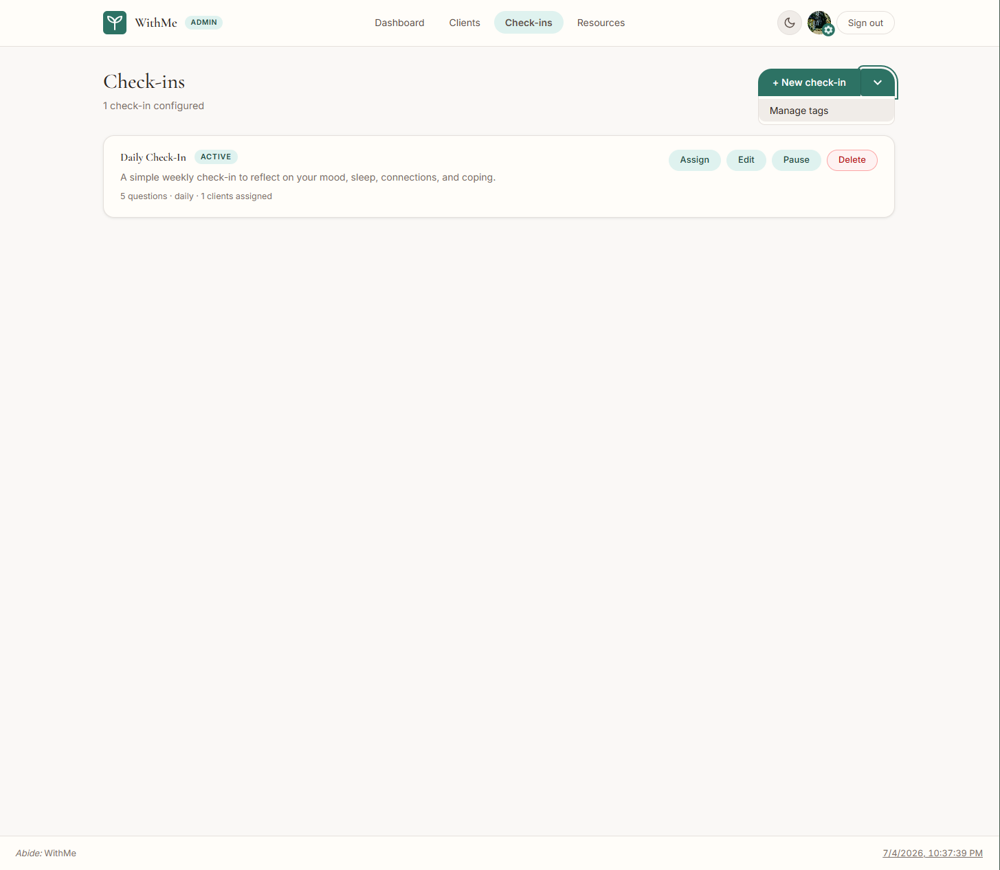

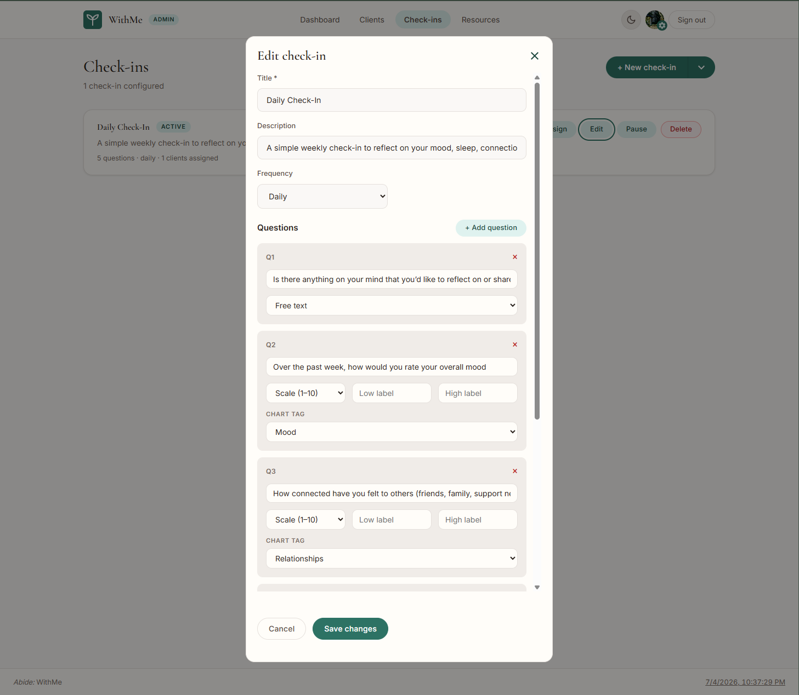

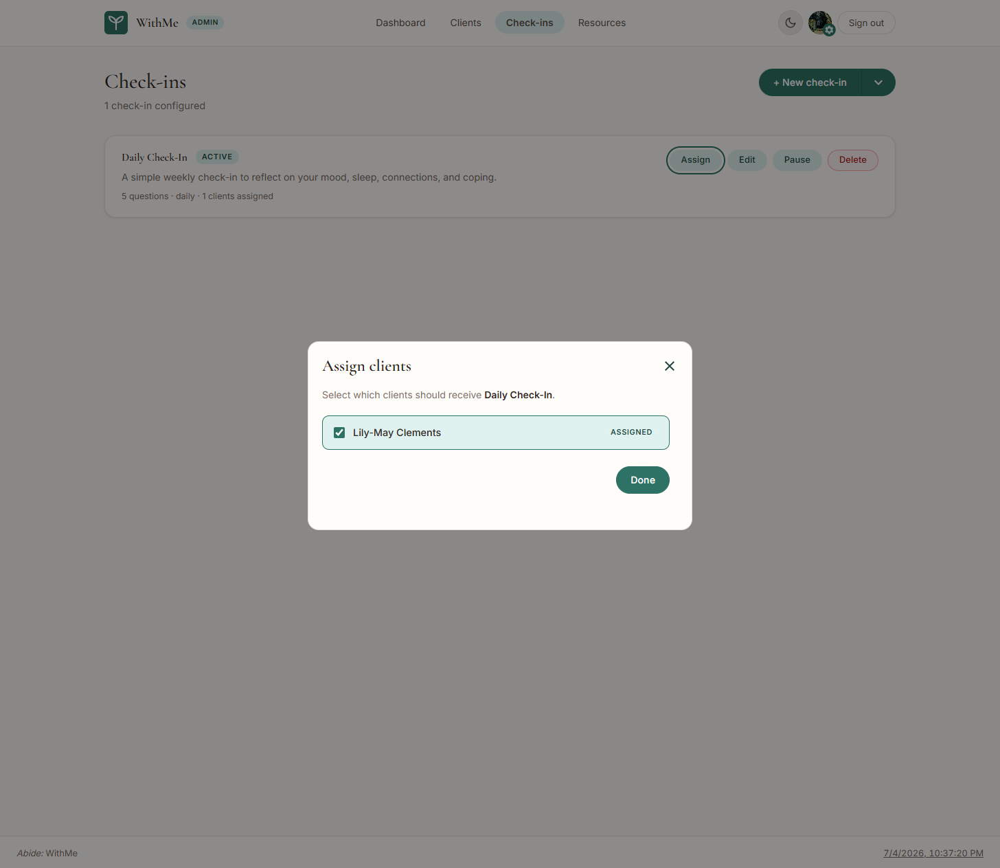

---

### Admin — Activity log

Filterable audit trail of all actions across clients, check-ins, resources, and tags.

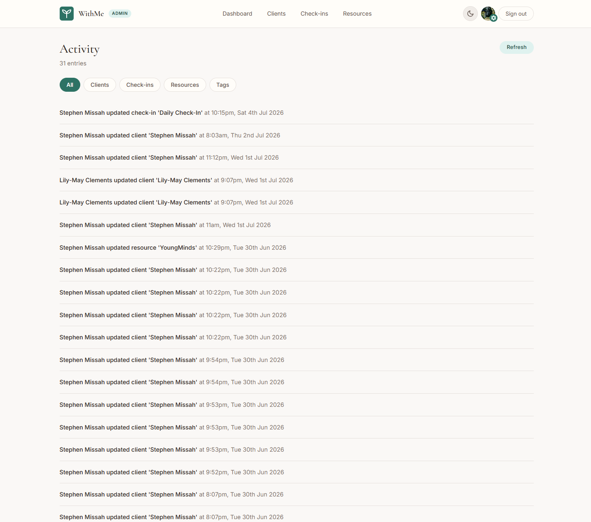

---

### Client — Dashboard (light & dark mode)

Personalised greeting, an inspirational quote shaped by focus keywords, wellbeing stats, progress chart, and quick access to pending check-ins and resources.

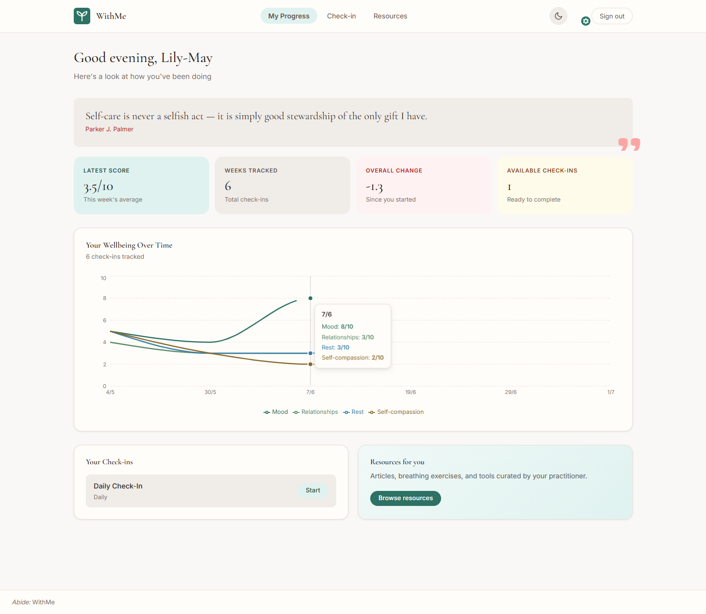

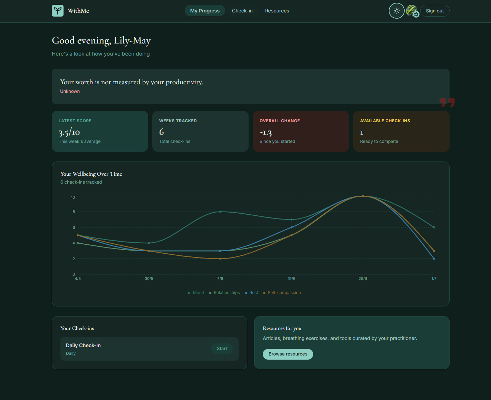

---

### Client — Check-in flow

Step-by-step guided check-in with a progress bar and 1–10 scale or free-text questions.

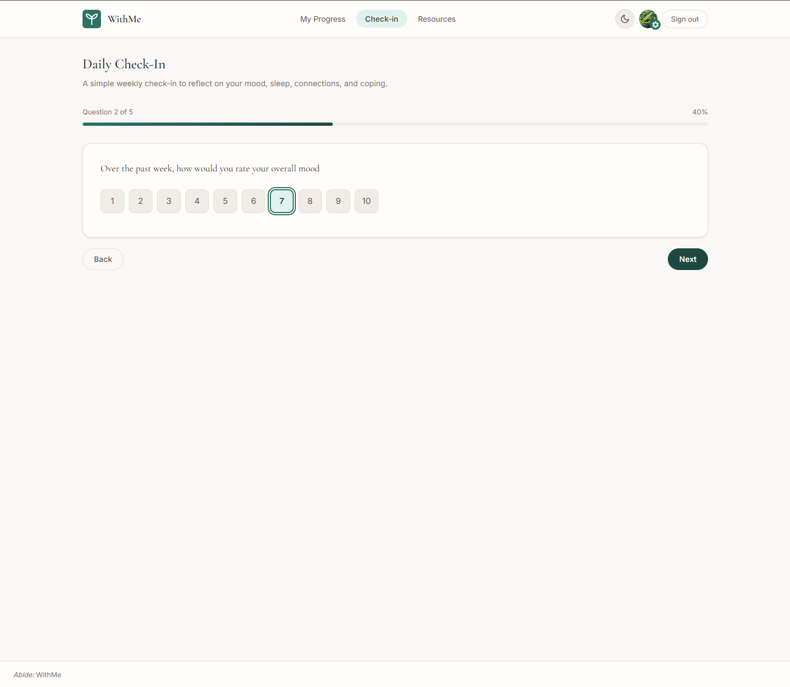

---

### Client — Resources

Practitioner-curated resources filtered by type (websites, documents, articles, videos).

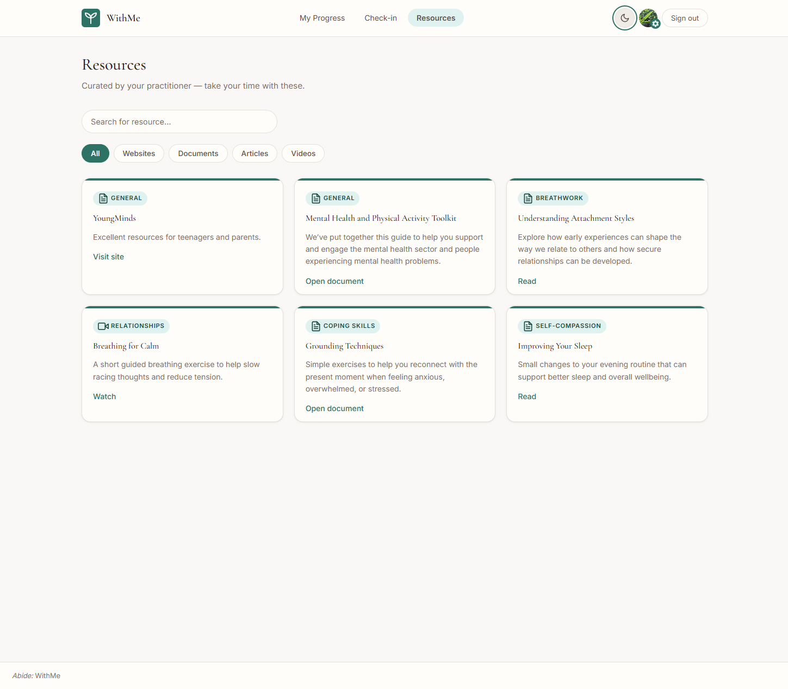

---

### Client — Settings

Update display name, profile photo, and focus keywords — the keyword selection shapes the inspirational quotes shown on the dashboard.

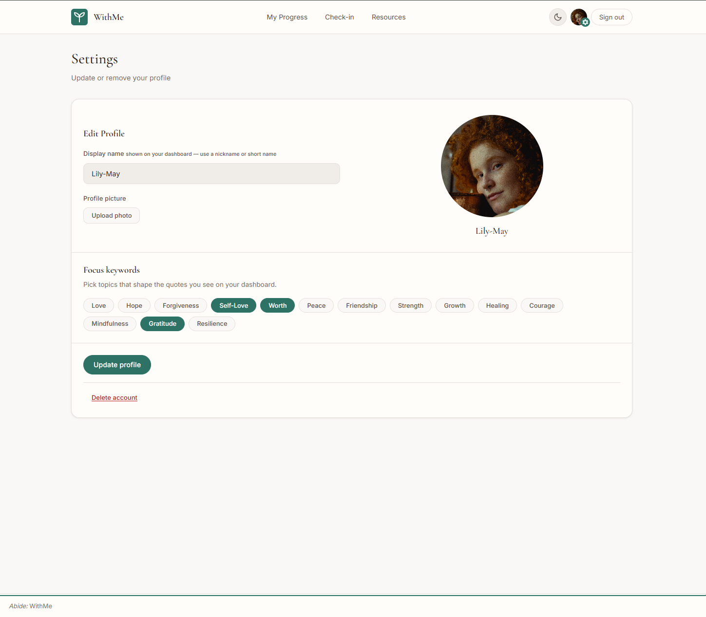

---

## Features

### Client portal
- Progress dashboard showing check-in history, score trend, and improvement over time
- Toggleable line graph and heatmap view (Recharts)
- Step-by-step check-in form supporting scale and free-text question types
- Resource library with articles and embedded videos, filtered by type
- Age-appropriate content filtering based on client date of birth
- Onboarding flow on first login (display name, avatar, focus keywords)
- Settings page for profile management

### Admin panel
- Client list with DOB, adult status, and inline progress chart per client
- Questionnaire builder — add questions, set type (scale/text) and frequency, pause/activate
- Resource manager — create articles, add YouTube videos, toggle publish/draft
- PDF export of client data (generated in-browser)

### UX
- Dark/light mode, toggled via a class on `<html>` and persisted to localStorage
- Mobile-responsive layout with collapsible navigation
- Keyboard navigation, focus-visible styles, skip link, and `aria-live` regions throughout
- `prefers-reduced-motion` respected in CSS

---

## Architecture

**Auth** uses a dual-layer approach. `AuthContext` (`src/context/AuthContext.tsx`) is the live source of truth — it holds the Supabase session, user profile, and role. Components consume this via `useAuth()`. Redux slices handle the rest of the app state independently.

**Routing** splits into two role-based trees in `App.tsx`. `ProtectedRoute` accepts a `requiredRole` prop and redirects if the signed-in user doesn't match — admins are always redirected away from client routes and vice versa.

**Styling** uses SCSS design tokens (`src/styles/_colors.scss`, `_spacing.scss`, `_typography.scss`) exposed as CSS custom properties in `src/index.scss`. Dark mode is a `.dark` class on `<html>` — all colour changes are in CSS, no JS colour logic. Run `npm run sync-tokens` after editing token files.

**Supabase** — client singleton at `src/lib/supabase.js`. Key tables are typed in `src/models/globalTypes.tsx`: `users`, `questionnaires`, `questions`, `questionnaire_assignments`, `responses`, `resources`.
